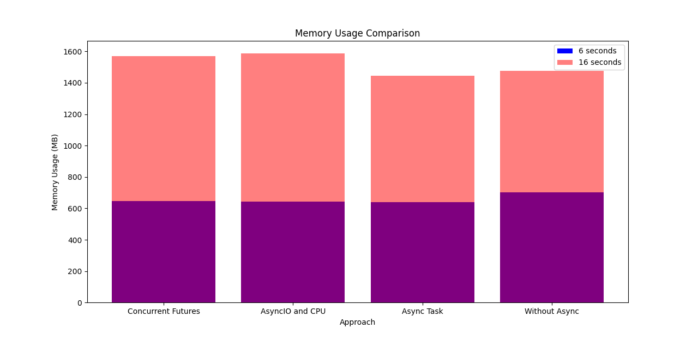
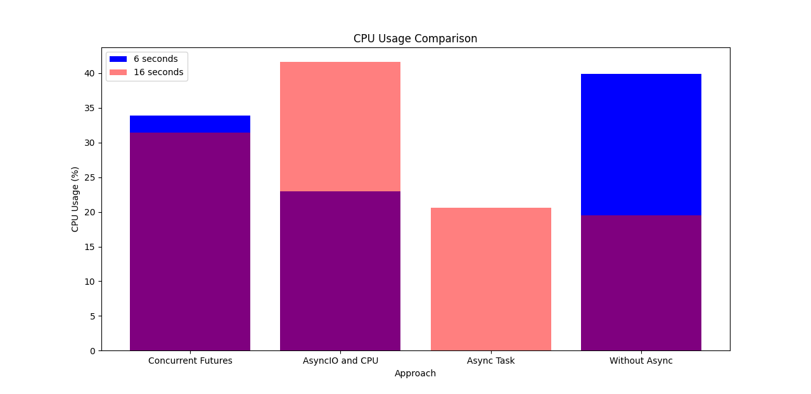
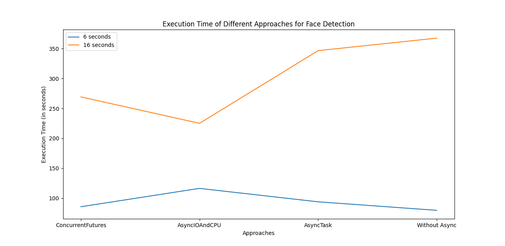

# Face Detection in Mimasa

The current implementation provided the ability to choose the approach whether to run the detection asynchronously or not.
The following are approaches that can be used.

## AsyncTaskFaceDetection

## ConcurrentFuturesFaceDetection

### TODO

## Performance results

### Memory Usage Comparison

### CPU Usage Comparison

### Execution Time Comparison

